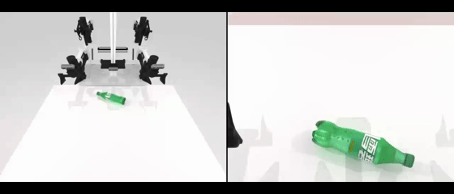
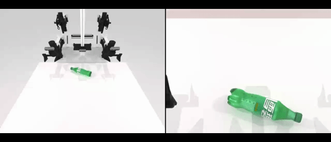
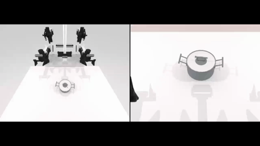
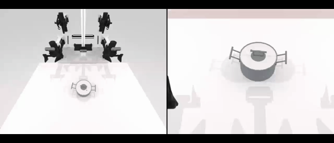
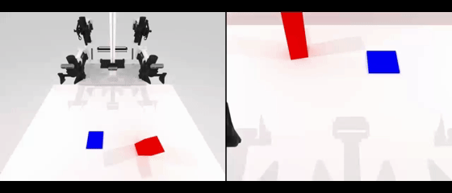
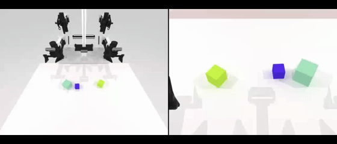
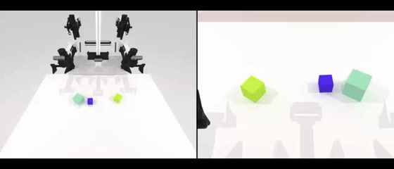

# RDT × RoboTwin Lab

An end-to-end **bimanual VLA adaptation framework** built around released
RDT-1B and RoboTwin. I built this repository to connect the parts that are
usually scattered across upstream projects: task construction, expert data
generation, multimodal alignment, task-specific fine-tuning, policy serving,
and closed-loop simulation evaluation.

```text
Task Construction
→ Expert Planning & Trajectory Filtering
→ Multiview RGB / State / Action Collection
→ Temporal / Language / Frequency Alignment
→ RDT-1B Task Fine-tuning
→ XPolicyLab Policy Serving
→ RoboTwin Closed-loop Evaluation
```

## What I built

The RDT backbone itself follows the upstream implementation. The project work is
focused on making that model usable as a complete RoboTwin training and
evaluation pipeline:

- **Robot data pipeline** — generate and filter expert trajectories, replay
  successful seeds, and serialize three-view RGB, bimanual state/action, and
  language into episode-level HDF5 data.
- **Multimodal alignment** — align `State(t) → Action(t+1)`, keep 15 Hz control
  semantics consistent, bind each HDF5 episode to its own T5 embedding, and use
  task-specific normalization statistics.
- **Low-shot fine-tuning** — adapt released RDT-1B weights to RoboTwin tasks with
  roughly 50 demonstrations using DeepSpeed ZeRO-2, BF16, gradient
  accumulation, checkpointing, and precomputed language embeddings.
- **Online policy deployment** — connect RoboTwin to an RDT policy server through
  XPolicyLab, maintain runtime observation history, execute action chunks, and
  keep checkpoint/input/same-seed audit hooks for debugging.
- **Reproducible evaluation** — evaluate policy rollouts with the task's own
  `check_success()` predicate and keep Clean/Randomized settings separated for
  later robustness analysis.

The source snapshot retains representative task implementations for
`adjust_bottle` and `pick_dual_bottles`. The recorded demo suite below extends
the evaluation coverage to synchronized lifting, arm-to-arm handover and
target placement, and multi-object size ordering.

> **Scope.** The project starts from released RDT-1B weights; it does not rerun
> foundation-model pretraining. Evaluation is currently simulation-only. Model
> weights, raw datasets, checkpoints, and RoboTwin assets are intentionally not
> committed.

## Demo

The four RoboTwin tasks below are ordered from easier, short-horizon control to
harder, long-horizon bimanual manipulation. **Policy rollout** shows the model's
closed-loop test result, while **expert demonstration** is the corresponding
programmatic expert trajectory used to collect the training data. Asset names
ending in `_ex` denote expert demonstrations.

| Difficulty | Task | Policy rollout | Expert demonstration |
| --- | --- | --- | --- |
| 1 | **Adjust bottle and hold upright** (`adjust_bottle`) |  |  |
| 2 | **Bimanual pot lift** (`lift_pot`) |  |  |
| 3 | **Arm-to-arm block handover and placement** (`handover_block`) |  |  |
| 4 | **Order blocks from large to small** (`blocks_ranking_size`) |  |  |

The sequence highlights progressively stronger requirements:

1. **Adjust bottle and hold upright** tests single-object localization, arm
   selection, grasping, and precise orientation control.
2. **Bimanual pot lift** adds synchronized grasping of both handles and stable
   two-arm lifting.
3. **Arm-to-arm block handover and placement** requires temporal coordination,
   a reliable transfer between grippers, and precise placement on the blue
   target.
4. **Order blocks from large to small** combines visual size reasoning with
   repeated pick-and-place decisions over a longer horizon, ending with a
   left-to-right descending-size arrangement.

## RDT architecture overview

RDT-1B is included here so the training and deployment path can be followed from
source. The architecture below is **upstream RDT**, not a new model design from
this project.

```text
Language ── T5 ────────────────┐
                               │
3-camera RGB × 2-frame history │
        └── SigLIP ────────────┼── Modality Adapters ──┐
                               │                       │
Robot state + validity mask ───┘                       ▼
                                               RDT / DiT Backbone
Diffusion timestep ────────────────────────────► 28 Transformer blocks
Control frequency ─────────────────────────────► 2048 hidden / 32 heads
                                                       │
                                                       ▼
                                                64-step Action Chunk
```

The retained configuration uses a **128-D unified state/action space**, three
cameras, two-frame visual history, and a 64-step prediction horizon. T5,
SigLIP, and robot state/action tokens are projected into the shared Transformer
space through modality-specific adapters. Training uses DDPM forward noise on
the action sequence; inference starts from Gaussian action noise and applies
DPM-Solver denoising to recover the final action chunk.

See [`docs/architecture.md`](docs/architecture.md) for the module-level mapping
to `rdt/models/rdt/`, `rdt_runner.py`, and the multimodal encoders.

## Robot data pipeline

The data path starts from a RoboTwin task rather than from a pre-built offline
dataset:

```text
RoboTwin / SAPIEN Task
        ↓
Expert Planning + Success Gate
        ↓
Seed Replay + Multimodal Capture
        ↓
Episode HDF5
        ↓
Temporal / Language / Frequency Alignment
        ↓
Normalization + Validation
        ↓
RDT Fine-tuning Dataset
```

### Expert generation and quality filtering

RoboTwin programmatic motion primitives are used to generate demonstrations.
`robotwin/scripts/collect_data.py` only accepts trajectories satisfying

```text
plan_success && check_success()
```

The successful seed and joint path are saved, replayed under the same scene
initialization for observation capture, and validated again before the episode
is retained. This gives the dataset an explicit trajectory-level quality gate
instead of treating every simulator rollout as valid training data.

### Multimodal and temporal alignment

Each accepted episode stores the policy conditions in one HDF5 boundary:

```text
episode_xxxxxxx.hdf5
├── /vision/{cam_head, cam_left_wrist, cam_right_wrist}/colors
├── /state/{left/right arm, left/right end-effector}
├── /action/{left/right arm, left/right end-effector}
├── /instructions
└── /additional_info/frequency
```

For a trajectory `q[0..N-1]`, training samples are constructed as

```text
RGB    = RGB[:-1]
state  = q[:-1]
action = q[1:]
```

so the supervision semantics remain `RGB(t), State(t) → Action(t+1)` with a
shared `N-1` horizon. The RoboTwin fine-tuning path keeps control frequency at
**15 Hz**, so an action step represents the same physical time scale during data
preparation, training, and policy execution.

### Episode-level language and distribution adaptation

Language is aligned at demonstration granularity:

```text
data/.../episode_0000007.hdf5
             ↕
lang_embeds/.../episode_0000007.pt
```

`policy/rdt_1b/encode_language.py` encodes each episode instruction with T5,
and the HDF5 loader derives the matching embedding path from the episode path.
This keeps vision, proprioception, action, and language bound to the same
trajectory.

Task-specific state/action statistics are used for normalization before
fine-tuning. The retained `demo_clean.yml` defines a controlled 50-episode data
setting, while RoboTwin's randomization axes are kept for later robustness
evaluation. Exact sequence conventions are documented in
[`docs/dataset_alignment.md`](docs/dataset_alignment.md).

## Fine-tuning and evaluation

The downstream experiment is a task adaptation stage rather than a second
foundation-model training run:

```text
Released RDT-1B
      ↓
~50 RoboTwin Demonstrations
      ↓
Task-specific Fine-tuning (~10k-step schedule)
      ↓
Policy Server
      ↓
Closed-loop RoboTwin Rollout
      ↓
check_success()
```

### Training engineering

`policy/rdt_1b/train.sh` provides the RoboTwin fine-tuning entry point. The
training path uses **DeepSpeed ZeRO-2 + BF16**, configurable gradient
accumulation, HDF5 loading, precomputed language embeddings, image augmentation,
checkpoint save/resume, and W&B-compatible reporting. CUDA/NCCL settings are
exposed as runtime configuration so local communication workarounds do not leak
into model logic.

The retained environment records an **NVIDIA RTX 6000 Ada**, PyTorch 2.1,
CUDA 12.1, DeepSpeed 0.14.2, and FlashAttention 2.5.5.

### Training diagnostics

I separate optimization failures from data-conditioning failures during
training. Loss/NaN behavior, learning rate, VRAM and throughput are checked
alongside HDF5 structure, normalization statistics, language embeddings, action
masks, and control frequency. Diffusion reconstruction loss is useful for
optimization monitoring, but final policy quality is determined by closed-loop
task completion rather than loss alone.

### Closed-loop evaluation

```text
RoboTwin Observation
        ↓  WebSocket / TCP
RDT Policy Server
        ↓
64-step Action Chunk
        ↓
RoboTwin Execution
        ↓
Task-specific check_success()
```

`robotwin/scripts/eval_policy_xpolicylab.py` stores outputs by task/checkpoint
and provides same-seed and fixed-instruction audit hooks. Initial qpos, camera
observations, instruction, and the first predicted action chunk can be captured
together to distinguish environment differences from policy-input or
policy-output differences.

Clean and Randomized settings are treated as different evaluation questions:
Clean measures task execution under the training-like distribution, while
Randomized measures robustness to scene, lighting, background, object-pose, and
camera changes. Upstream RoboTwin/RDT results are used as reference benchmarks
only when the evaluation protocol is aligned.

## Online inference and deployment

The deployment path uses XPolicyLab to decouple RoboTwin from the RDT model
process:

```text
RoboTwin
  RGB / qpos / instruction
        ↓
XPolicyLab Client ── WebSocket/TCP ── RDT Policy Server
                                      ↓
                         preprocessing + 2-frame history
                                      ↓
                              T5 / SigLIP / RDT
                                      ↓
                              64-step Action Chunk
        ┌─────────────────────────────┘
        ▼
RoboTwin joint control → next observation → next policy query
```

`policy/rdt_1b/model.py` converts each observation to three RGB views, bimanual
joint state, and an instruction, maintains a per-environment two-frame history,
and caches the episode language embedding. The runtime contract is explicit:
**joint-space control, 15 Hz, 64-step chunks, BF16 CUDA inference**.

The deployment code also retains checkpoint-load, input, and same-seed audits.
These diagnostics make it possible to separate checkpoint/configuration errors,
observation-schema mismatches, policy outputs, and simulator execution when a
rollout stalls or drifts. Long-horizon failures are analyzed as a closed-loop
problem: small action errors can change later observations and compound over the
rest of the trajectory.

## Results

This section is reserved for the final experiment summary. Local results and
upstream reference numbers will be presented separately so the provenance of
each metric remains clear.

Planned result views:

- task success rate for representative RoboTwin tasks;
- Clean vs. Randomized robustness comparison;
- `adjust_bottle` vs. `pick_dual_bottles` task-complexity comparison;
- qualitative rollout/failure cases;
- upstream RDT/RoboTwin benchmark references under the matching protocol.

<!--
Planned local result table:

| Task | Setting | Episodes | Success Rate | Notes |
| --- | --- | ---: | ---: | --- |
| adjust_bottle | Clean |  |  |  |
| adjust_bottle | Randomized |  |  |  |
| pick_dual_bottles | Clean |  |  |  |
| pick_dual_bottles | Randomized |  |  |  |
-->

## Repository layout

```text
rdt-robotwin-lab/
├── rdt/                    # RDT Transformer, diffusion runner, encoders, trainer
├── robotwin/               # tasks, expert collection, conversion, evaluation
├── policy/
│   ├── rdt_1b/             # RoboTwin adaptation, training, inference
│   └── xpolicylab/         # policy client/server runtime
├── experiments/            # task statistics and experiment artifacts
├── configs/                # retained configuration snapshots
├── scripts/                # end-to-end entry points
├── docs/                   # architecture and data-alignment notes
├── environment/            # software / CUDA environment records
└── patches/                # modification history for auditability
```

## Quick start

```bash
# 1. Collect expert demonstrations
bash scripts/collect_demo.sh adjust_bottle demo_clean 0

# 2. Prepare/link the RoboTwin HDF5 dataset
bash scripts/prepare_dataset.sh adjust_bottle demo_clean 50

# 3. Encode one language embedding per episode
bash scripts/encode_language.sh RoboTwin adjust_bottle arx_x5 joint 50 /path/to/data --gpu 0

# 4. Fine-tune released RDT-1B
bash scripts/finetune_rdt.sh RoboTwin adjust_bottle arx_x5 joint 0 0

# 5. Start the policy server
bash scripts/serve_rdt.sh

# 6. Run RoboTwin closed-loop evaluation
bash scripts/eval_robotwin.sh RoboTwin adjust_bottle <checkpoint> arx_x5 joint 0 0 0 rdt_1b robotwin
```

The official upstream pretraining entry is retained for source inspection via
`bash scripts/pretrain_rdt.sh`; it is not part of the local task-fine-tuning
experiment.

## External requirements

Model assets can be placed or symlinked under:

```text
policy/rdt_1b/weights/RDT/
├── rdt-1b/
├── t5-v1_1-xxl/
└── siglip-so400m-patch14-384/
```

RoboTwin simulation assets can be linked under `robotwin/assets` or provided via
`ROBOTWIN_ASSETS_ROOT`.

## Attribution

RDT and RoboTwin sources are MIT licensed; XPolicyLab is Apache-2.0. See
`THIRD_PARTY_NOTICES.md` and the component license files for upstream revisions
and modification scope.
